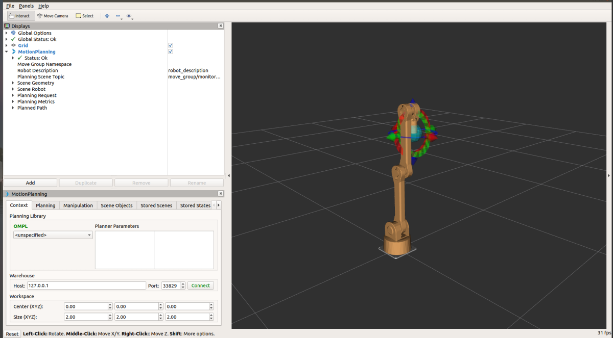
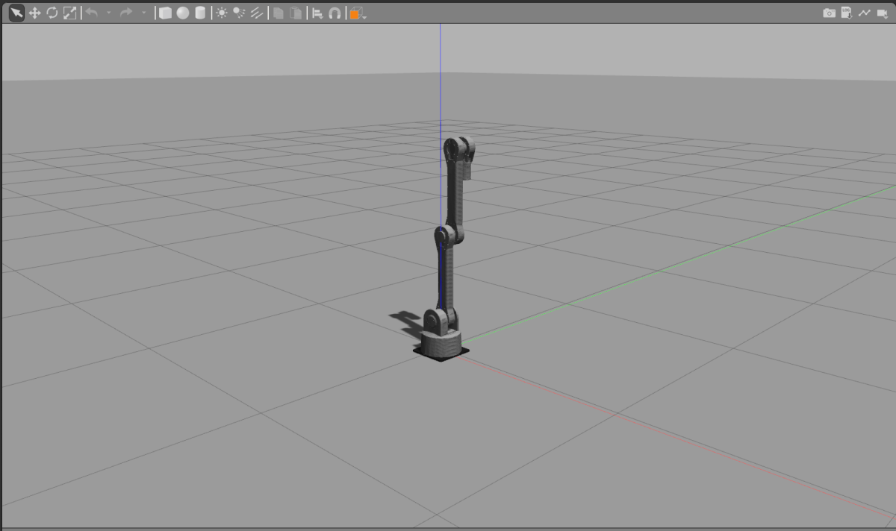

# protobot_arm  
**protobot_arm_description**:机械臂模型描述    
**protobot_gripper_description**:机械手模型描述   
**protobot_arm_gripper_description**:机械臂+手模型描述   
**protobot_arm_moveit_config**:机械臂moveit功能包配置（客户端）    
**protobot_arm_gripper_moveit_config**:机械臂+手moveit功能包配置（客户端）    
**protobot_arm_gripper_bringup**:机械臂+手moveit服务器程序，用于连接客户端和真实机械臂   
**pd_drive**:”舵机版机械手“的机械臂Due控制版Arduino程序      
**pt_drive**:”步进版机械手“的机械臂Due控制版Arduino程序      

## 机械臂模型文件展示   
***Display in Rviz,使用滑块条拖动关节转动***   
```bash
roslaunch protobot_arm_gripper_description display.launch gui:=true  
```
  
***Display in Gazebo，发布关节位置topic（命令行或rqt工具）***   
```bash
roslaunch protobot_arm_gripper_description gazebo.launch  
rostopic pub -1 /rot_joint_position_controller/command std_msgs/Float64 "data: 1.5"  
```
  
## 机械臂Moveit功能包demo   
***Moveit demo fake execution***   
```bash
roslaunch protobot_arm_gripper_moveit_config demo.launch   
```
   
***Moveit demo execution in gazebo***   
```bash
roslaunch protobot_arm_gripper_moveit_config demo_gazebo.launch   
```
   
***错误解决***   
```bash
sudo apt-get install ros-melodic-joint-trajectory-controller
sudo apt-get install ros-melodic-gripper-action-controller
```   
## 真实机械臂Moveit控制  
1. 下载pd_drive or pt_drive到机械臂控制器，将控制器USB口插入电脑     
2. 校准机械臂   
   ```bash
   roslaunch protobot_arm_gripper_bringup driver.launch  calibration:=true   
   roslaunch protobot_arm_gripper_bringup protobot_arm_gripper_bringup.launch calibration:=true  
   ```
   拖动滑块条使机械臂转动至竖直状态，然后Ctrl+C关闭上述两个程序   
3. 控制机械臂运动  
   ```bash
   roslaunch protobot_arm_gripper_bringup driver.launch   
   roslaunch protobot_arm_gripper_bringup protobot_arm_gripper_bringup.launch  
   ```  
